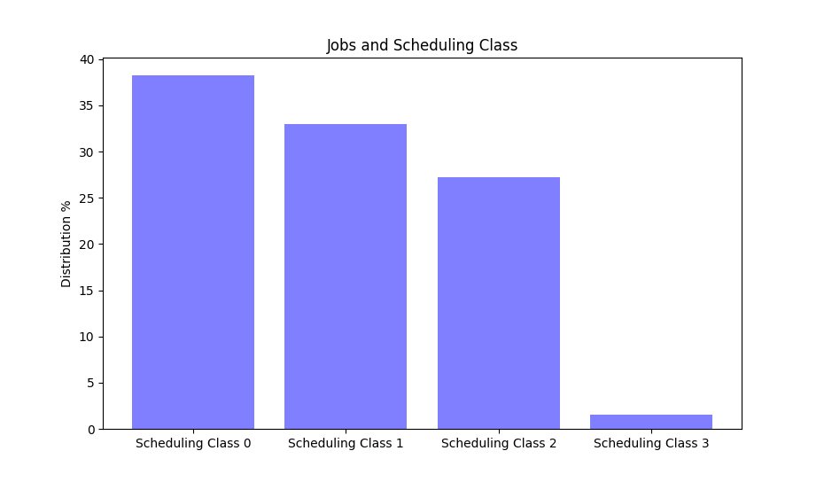

# Data Management in Large-Scale Distributed Systems Project
###### MOSIG M2 - 2019/20 
###### Members: Gabriel BENEVIDES - Gabriel JOB ANTUNES GRABHER


## Project Description
In this project we will carry on several analysises on the data set available online representing 29 days worth of information on one of  _Google_'s [large scale clusters](https://github.com/google/cluster-data/blob/master/ClusterData2011_2.md), compromising about 12.5k machines. There are hundreds of files available detailing the behavior of said machines, as well as the jobs and tasks they are carrying out over this time period.

The data were downloaded using a custom made script, **downloads.sh**, which was written to automatically push files from google's cloud storage (using the [_GSUtil_](https://cloud.google.com/storage/docs/gsutil) tool) and unzip them immediately after in the current path destination. To facilitate the final calculations, we have decided to not use **all** the files, instead focusing on at most **100** files for each category. That is, when that many are available. Each analysis will be made using _spark_ transformations on the resilient distributed dataset (RDD) created for manipulation of out data.

In addition to this _report_ the files in the submission are:

* One _python_ (.py) file for each of the analyses or questions answered.
* The _python_ (.py) file containing the solution for the analysis done with _pandas_.
* The aforementioned custom-made script **script.sh**, which helped downloading and unzipping the task/job events files, for consultation purposes.
* Images containing the graphics shown in the report, located in the _images_ folder.
* The _allResults.txt_ file, which has a record of the output of each of the anaylises, for consultation purposes.

## Work on the Dataset

The studies executed where made to show a few possibilities of what **Spark** can do. With that said, the analyses will consist of basic questions, some suggested in the [_project description_](https://tropars.github.io/downloads/lectures/LSDM/LSDM-lab-spark-google.pdf) and some which were not. In some cases, the _time_ library of python will be used also to register the elapsed time for a given processing to be done by spark. Once again, it is worth mentioning that the computational resources were limited. As such, we decided to use only _100 files for task and job events_, out of 500 in total. This number would not slow the machines down so much, as well as not cost so much space in the hard-drive, while still being able to measure the capabilities and versatility of Spark.

We move on to the anaylises.

### Analysis of resource losses due to removals

In this step we are interested in estimating how much CPU and memory are lost due to machine removal. To do so, we will process data on the _machine_events_ files. All of the code for this analysis can be found on the file "machine_removal_analysis.py".

* CPU analysis:

Ideally we need an RDD with information about the CPU capacity added and removed for all machines during the processing. So we start by reading the _machine_events_ entries into a RDD by using the Spark method _textFile()_ and then applying _map()_ into it to split the lines.

After that we can get a new RDD with the amount additions and removals of a machine, and the capacity of CPU it makes available. The following line of code gives a RDD composed of key-value pairs [machine ID, (number of removals, CPU capacity, number of additions)], where the number of removals is the amount of times it was removed from the cluster, and the number of additions when it's added to the cluster.

```Python
cpu_rm_ratio = entries.filter(lambda x: x[2] != u'2' and x[4] is not u'')\
	.map(lambda x:(x[1],(1,float(x[4]),0)) if x[2]==u'1' else (x[1],(0,float(x[4]),1)))\
	.reduceByKey(lambda x,y: (x[0]+y[0], x[1], x[2]+y[2]))
```

Basically, the _filter()_ is selecting only the ADD and REMOVE events with CPU capacity not empty. Then, _map()_ creates pairs [(machine ID, (event == REMOVE, CPU capacity, event == ADD))] so that _reduceByKey()_ can be used to sum only the quantity of events for each machine ID.

With that, we can calculate the total amount of CPU lost and added during the processing. We can achieve that by applying _map()_ to the previous RDD to create pairs [number of adds/removes, total CPU added/removed] for each machine, and then using _reduce()_ to sum both fields to get the values for the whole processing. This part can be seen on the lines:

```Python
cpu_loss_all = cpu_rm_ratio.map(lambda x: (x[1][0], x[1][0]*x[1][1])).reduce(lambda x,y: (x[0] + y[0], x[1] + y[1]))
cpu_gain_all = cpu_rm_ratio.map(lambda x: (x[1][2], x[1][2]*x[1][1])).reduce(lambda x,y: (x[0] + y[0], x[1] + y[1]))
```

If we want to consider only the removals due to maintenace, we need to compare the ratio of adds/removes: if it's the same, then it's sequence of events obligatory ended with a REMOVE, since it cannot be added or removed twice in a row and it always starts with an ADD (consider the sequence ADD-REMOVE-ADD-REMOVE). In the opposite case, if the number of removes plus one is equal to the number of additions, then we know that it ended with a maintenance (e.g. ADD-REMOVE-ADD), where a sequence REMOVE-ADD signifies a maintenance. There's also the case when the machine is never removed, then we have only one ADD event and by consequence no losses. In the following line we can calculate the amount of cpu lost due to maintenance:

```Python
cpu_loss_maintenance = cpu_rm_ratio.map(lambda x: (x[1][0], x[1][0]*x[1][1]) if x[1][0]+1 == x[1][2] else (x[1][0] -1, (x[1][0] -1)*x[1][1]))\
    .filter(lambda x: x[0] > 0).reduce(lambda x,y: (x[0] + y[0], x[1] + y[1]))
```

Then, to calculate the percentages we can simply the total loss by the total gain, or equivalently, the maintenance loss by the total gain, which gives:

```
The percentage of cpu loss for all removals is 41.9495443138                    
The percentage of cpu loss for maintenance is 41.489455378 
```

From the difference, we can get the percentage of loss due to other reasons than maintenance:
```
The percentage of cpu loss for failures is 0.460088935852
```

Similarly, we can follow the same steps to calculate the percentage of memory loss due to maintenance, which is:
```
The percentage of memory loss for maintenance is 42.470537611
```

From these results we can see that almost half of the resources are lost due to maintenance during the whole processing, which represents almost 99% of the reasons of machine removal.


### Analysis of the distribution of machines according to CPU and MEMORY capacity

This analysis can be found in the "machines_distribution_analysis.py". Its purpose is to use the _machine_events_ file to estimate the distribution of machines in relation to its CPU and memory capacity.
First, we begin by creating a RDD with the entries of the file, then we change it to a more useful format for us. This is done with the combination of a _map()_ method to get (machine ID, (CPU, Memory)) key-value pairs with only the relevant fields for the analysis, and after with the _distinct()_ and _filter()_ methods to select distinct non-empty entries. With that we are able to calculate the total number of valid machines with:
```Python
machine_nb = machines.count()
```
Now we need to count the number of machines for each CPU and memory capacities, to do so we apply another _map()_ to the previous RDD to get new key-value pairs in the form of (CPU capacity, 1) and (Memory capacity, 1), and Spark has a counting method for these cases in _countByKey()_(_reduceByKey(add)_ was an equally valid option). Finally, we divide these values by the total number of machines to get the distributions. These operations can be seen on the lines:
```Python
dist_cpu = machines.map(lambda x: (float(x[1][0]),1)).reduceByKey(add).map(lambda x: (x[0], float(x[1])*100/machine_nb))
dist_mem = machines.map(lambda x: (float(x[1][1]),1)).reduceByKey(add).map(lambda x: (x[0], float(x[1])*100/machine_nb))
```
The output on the terminal looks like this:

```
Distribution of machines according to cpu capacity:

CPU capacity: 0.25; Distribution: 1.0007942811755361%
CPU capacity: 0.5; Distribution: 92.66084193804606%
CPU capacity: 1.0; Distribution: 6.338363780778396%

Distribution of machines according to memory capacity:

Memory capacity: 0.03085; Distibution: 0.03971405877680699%
Memory capacity: 0.06158; Distibution: 0.007942811755361398%
Memory capacity: 0.1241; Distibution: 0.4289118347895155%
Memory capacity: 0.2493; Distibution: 30.706910246227164%
Memory capacity: 0.2498; Distibution: 1.0007942811755361%
Memory capacity: 0.4995; Distibution: 53.47100873709293%
Memory capacity: 0.5; Distibution: 0.023828435266084195%
Memory capacity: 0.749; Distibution: 7.966640190627482%
Memory capacity: 0.9678; Distibution: 0.03971405877680699%
Memory capacity: 1.0; Distibution: 6.314535345512311%
Total time elapsed: 3.038912534713745 seconds.
```


The resulting distributions can be seen on the following plots:


We can easily note that for both the CPU and memory capacities, the trend seems to be that the machines end up disponibilizing half of its resourses, other than that, small variations can occur but not as significant. This analysis was conducted by Spark in **3.04** seconds.

## Do tasks with low priority have a higher probability of being evicted? Part 1

For this analysis we will use the _task events_ file. We are interested in computing the probability of a given task event to be an **eviction event**, in relation to its task's _priority_. That is, in relation to the priority of the job for which this given task belongs to.
Indeed, as the [documentation](https://drive.google.com/open?id=0B5g07T_gRDg9Z0lsSTEtTWtpOW8&authuser=0) explains, the priority of a job normally determines the priority of its tasks. In other words, all tasks related to a job should have the same priority.

In terms of transformations on our _RDD_, we intend to use Spark to _map_ it into a new structure that ideally contains one entry for each different priority level that is present in the data set.
Each entry in this new structure will in turn contain two distinct pieces of information:

* The probability of an **eviction event** for a task with this given priority.
* The total number of **all the events** that happened to any task with the same parent Job.

This is necessary because we consider the **Probability of Eviction** as the _number of eviction events for any task belonging to a job divided by the number of the total of events for any task belonging to this same job_. The task indexes individually don't have a great importance because the average would remain the same for the Job as a whole.

To achieve this organization, each entry (task event) in the inital _RDD_ will be eventually mapped to the following shape:

```
For each task event T:
  (Priority of T, (ID of T's Job, Event Type))
```
Following, we will construct an _Eviction Rate by Priority_ RDD, which will consist of yet a new arrangement:
```
For each task event T:
  If Event Type is Eviction:
    (Priority of T , (1,0))
  Else:
    (Priority of T , (0,1))
```
With this new RDD we can know if any given task event was of type _eviction_ or not. This is usefull to have a final number of total evictions and of total events for any priority.
Finally we will reduce our set by priority key, which means that we will reduce the set to one single entry per priority, adding all this information together and computing the probability at the end. Spark will conduct these operations with commands that looks like this:

```Python
reduction = evictRate_byPriority.reduceByKey(lambda x, y: (x[0] + y[0], x[1]+y[1])).map(lambda x: (int(x[0]), (100*(x[1][0]/(x[1][0]+x[1][1])), x[1][0]+x[1][1])))
```

The results are as follows:

```
Probability of evict event by priority:
Priority 0: 7.629659465037097% of having a task evicted. Out of 16875301 events with this priority level.
Priority 1: 8.070885808483835% of having a task evicted. Out of 1741618 events with this priority level.
Priority 2: 1.0347617678510752% of having a task evicted. Out of 1759922 events with this priority level.
Priority 3: 8.374384236453201% of having a task evicted. Out of 1827 events with this priority level.
Priority 4: 0.1140258749190515% of having a task evicted. Out of 8811158 events with this priority level.
Priority 5: 0.0% of having a task evicted. Out of 93 events with this priority level.
Priority 6: 0.01775301998595539% of having a task evicted. Out of 253478 events with this priority level.
Priority 8: 0.5186483776835573% of having a task evicted. Out of 178541 events with this priority level.
Priority 9: 0.10400923130988833% of having a task evicted. Out of 3312206 events with this priority level.
Priority 10: 1.1040664626147791% of having a task evicted. Out of 9148 events with this priority level.
Priority 11: 0.0% of having a task evicted. Out of 16025 events with this priority level.

Total time elapsed: 201.9795045852661 seconds.
```
In graphical form, the distribution is as follows:


We can conclude that, indeed, it seems that tasks with low priorities have higher chances of being evicted. This makes sense too, because it is precisely to make available resources to other higher priority tasks that one task may be evicted.
We can see that for any given event that happens to lowest priorities, say zero and one, tasks there is around 8% chance of it being an eviction. For the higher priority tasks, starting already from the fourth level, the chance drops to nearly 0% of such an event happening. Finally, out of 16025 events that happened to level 11 priority tasks, none of them were evictions.

This analysis was performed with the use of Spark in **3.36** minutes, processing 32,959,317 lines of data.

## Do tasks with low priority have a higher probability of being evicted? Part 2

In this _bonus_ part, we prepared a python file that will perform the same analysis on the data set using Python's data analysis library [Pandas](https://pandas.pydata.org/). The code will not be complicated. We will read all data into one big data frame. Then, we will add two new columns, where one will say if an event is an eviction and the other will always hold a value '1' because it will compromise any kind of event. The full code is available in this submission. The trickiest part is grouping all entries by priority, it looks like this:

```Python
#Finally, we obtain a pandas' series where we will have event frequency grouped by priority
nTotalEventsByPriority = df.groupby('Priority')['AnyEvent'].count()
nTotalEvicitonsByPriority = dfEvictionsOnly.groupby('Priority')['AnyEvent'].count()
```

We will then run the _Spark_ solution and the _Pandas_ solution on the same number of files. Due to our limited resources we were only able to fetch 174 _task_event_ files in this post. So we will run the analysis on this number of files. The results for the _Spark_ solution were:

```
Probability of evict event by priority:
Priority 0: 6.014520266904253% of having a task evicted. Out of 30551780 events with this priority level.
Priority 1: 4.597629576561737% of having a task evicted. Out of 4544842 events with this priority level.
Priority 2: 1.0968530282471938% of having a task evicted. Out of 2075392 events with this priority level.
Priority 3: 8.082408874801903% of having a task evicted. Out of 1893 events with this priority level.
Priority 4: 0.09767313060468816% of having a task evicted. Out of 15509895 events with this priority level.
Priority 5: 0.0% of having a task evicted. Out of 126 events with this priority level.
Priority 6: 0.02350430363799612% of having a task evicted. Out of 425454 events with this priority level.
Priority 7: 0.0% of having a task evicted. Out of 751 events with this priority level.
Priority 8: 0.40502979885366464% of having a task evicted. Out of 306891 events with this priority level.
Priority 9: 0.14417164796355267% of having a task evicted. Out of 3835012 events with this priority level.
Priority 10: 1.1863466074649645% of having a task evicted. Out of 14414 events with this priority level.
Priority 11: 0.0% of having a task evicted. Out of 16949 events with this priority level.
Total time elapsed: 512.3925518989563 seconds.
```

The results for the _Pandas_ solutions were:

```
Final Averages: 
(0, 6.0145202669042526)
(1, 4.5976295765617374)
(2, 1.0968530282471938)
(3, 8.082408874801903)
(4, 0.097673130604688158)
(6, 0.023504303637996118)
(8, 0.40502979885366464)
(9, 0.14417164796355267)
(10, 1.1863466074649645)
Total time elapsed: 92.84956908226013 seconds.
```

As we can see the distributions over the different priorities are exactly the same, which is expected given that we are iterating over the exact same files. The first interesting fact to learn is that the _spark_ solution took **8.54** minutes to execute, whereas the _pandas_ solution executed in **1.55** minutes, in the same conditions. This behavior could be due to the fact that:

* These computations are not extreamely complex, and perhaps the data set is not huge enough jo justify the administrative costs of parallelizing with _spark_. 

* We are running these analyses in local context, without several hundreds of machines providing a big parallel computational power.

Even though _pandas_ proved to be faster here, it does not mean that it would stay that way with an incresead data magnitude or a more complex set of transformations on the data frame as a whole.

### Distribution of the number jobs/tasks per scheduling class

We are interested in knowing the distribution of tasks and jobs in relation to the different scheduling classes. This analysis will be done in terms of jobs and in terms of tasks, as such, 100 files from _job_events_ as well as 100 files from _task_events_ will be used.
The procedure will be the same for jobs and tasks, first we will use _spark_ to map all the events in terms of Scheduling class and job_id. Following this, we need to eliminate any duplicates because there may be many events for the same task. Finally, we will reduce this newly obtained map by key, which is the scheduling class. This way we can count how many tasks belong to each scheduling class. In the end we will be able to compare it to a total number of tasks to assess the distribution. The base code to cary out these operations looks something like this:
```Python
allEvents = entries.map(lambda x: (int(x[7]), x[2] )).distinct().map(lambda x: (x[0], 1))
reduction = allEvents.reduceByKey(add)  
```
The same procedure for an _RDD_ containing job_events:
```Python
allEvents = jobEntries.map(lambda x: (x[5], x[2] )).distinct().map(lambda x: (x[0], 1))
reduction2 = allEvents.reduceByKey(add)
```
The final distribution is as follows:

```
For the tasks:
Scheduling class 0 : 38.23496142795737 percent.                                 
Scheduling class 1 : 33.002284912788724 percent.
Scheduling class 2 : 27.216101471242528 percent.
Scheduling class 3 : 1.546652188011372 percent.
total is 132609
Total time elapsed: 221.31702589988708 seconds.

For the jobs:
Scheduling class 0 : 38.23445156426687 percent.                                 
Scheduling class 1 : 32.99811534112326 percent.
Scheduling class 2 : 27.215981907274784 percent.
Scheduling class 3 : 1.5514511873350922 percent.
total is 132650
Total time elapsed: 45.25424313545227 seconds.
```
We can equally plot this distribution for visualisation purposes:



As expected, we can see that the distributions ammount to 100% together, which is expected. It is also worthwile to mention that the distribution for jobs by scheduling class is very similar to that of the tasks by scheduling class. This is also expected because tasks have the same scheduling class as their parent jobs. Indeed, according to the [_google documentation_ ](https://drive.google.com/open?id=0B5g07T_gRDg9Z0lsSTEtTWtpOW8&authuser=0),jobs normally consist of identic tasks, that demand the same ammount of resources e possess the same priorities and scheduling class. Moreover, the files analyzed correspond to the same time frame which would mean that jobs and their related tasks would be activated within this window.

This analysis was computed using _spark_ in **3.68 minutes** for the tasks and **45 seconds** for the jobs, processing 200 files which contain approximately 33,353,310 lines of data. Once again, the transformations _map_ and _reduce_ came very useful to conduct the operations necessary on the dataset in a conscise way.

### Percentage/Frequency of jobs/tasks that got killed or evicted depending on the scheduling class

For this question, we will have two approaches to try and measure this relation.

* Firstly, we will split the task events into two groups. The first group contains all events that correspond to a _kill or evict_ action. The second group will be all events, including _kill or evict_. We can then organize each event by scheduling class and finally reduce them to have a final relation of _kill or evict_ events by total events for any given sheduling class. This will hopefully allow us to estimate, for any given event, what is the probabilty that it will be an eviction or a kill event, based on the scheduling class of this task.

* Secondly, we will try to change the point of view a little bit. Given that a task has a specific scheduling class, what is the chance that this task will be evicted or killed at somepoint. What is the chance that it will not be killed nor evicted? In order to do so, we'll again reduce the number of total events by scheduling class. Following, we'll do the same, except that we'll count the total number with a filtered _RDD_ containing only _kill or evict_ events. This will enable us to count distinct tasks and see how many were killed or evicted at some point at least once.

The basic transformations are:
```Python
#First proposition
allEvents = entries.map(lambda x: (x[7], (1,1)) if (x[5] == '2' or x[5] == '5') else (x[7], (0,1))).reduceByKey(lambda x, y: (x[0] + y[0], x[1]+y[1]))
percentages = allEvents.map(lambda x: (x[0], (100*(x[1][0]/(x[1][0]+x[1][1])))))

#Second proposition
allEvents = entries.map(lambda x: (x[7], (1, (x[2], x[3])))).distinct().reduceByKey(lambda x, y: (x[0] + y[0], x[1]))
tasksThatWereEvictedOrKilled = allEvents.filter(lambda x: x[5] == u'2' or x[5] ==u'5').map(lambda x: (x[7], (1, (x[2], x[3])))).distinct().reduceByKey(lambda x, y: (x[0] + y[0], x[1]))

```
After manipulating the results to calculate averages, they are printed on the output terminal. We can then generate the following graphics:


First Step
```
Probability of task event being EVICT or KILL based on scheduling class:
('0', 8.422286770195647)                                                        
('1', 6.850361433152736)
('2', 22.141683206075324)
('3', 17.02527194943253)
First part finished. Time elapsed: 191.8826973438263 seconds.
```

Second Step
```
Percentage analysis
Scheduling class 0 :32.03944801867268 percent.                                  
Scheduling class 1 :18.265014034833516 percent.                                 
Scheduling class 2 :66.9128349599222 percent.                                   
Scheduling class 3 :49.67025745734469 percent.                                  
Total time elapsed: 564.0192849636078 seconds.
```
These computations, using _map_, _reduce_ and _filter_ operations, were conducted by _Spark_ in **3.2 minutes** for the first step and **9.40 minutes** for the second step. Over this time, spark was processing around 32,959,317 lines of data, from the first 100 _task_event_ files available in the dataset, which is quite impressive.

We can see in the first graph that there isn't a very strong relation between a scheduling class of a task, and the frequency with which they can be evicted or killed. In general it seems that scheduling classes 0 and 1 have tasks which can be evicted or killed more often then scheduling classes 2 and 3. In the second graph the distribution at first looks similar, tasks which have scheduling classes 1 or 2, that are evicted or killed at least once, are less frequent then in the other scheduling classes. This time however, Scheduling classes 2 and 3 have tasks that are much more prone to being evicted or killed in their lifetime.

### Task resources lost due to general errors

The last analysis will be run on files from two separate types: _task_usage_ and _task_events_. The code is present in the file "task_resource_analysis.py". The main goal is to get an estimate of the amount of CPU processing and memory allocation lost due to tasks failing, being killed or lost.

First, we create two RDDs with the entries from the files, one for the task usages and other for the task events. Then we select the entries that are useful to the analysis and store them in the RDDs _task_usages_ and _task_failed_.

* For _task_usages_:
```Python
task_usages = entries.map(lambda x: ((x[2],x[3]), (float(x[5]),float(x[6])))).reduceByKey(lambda x,y: (x[0] + y[0], x[1] + y[1]))

```
We use the _map()_ method on the entries from the task usages file to create key-value pairs in the form of [(job ID, task index), (mean CPU usage rate, canonical memory usage)] then we apply _reduceByKey()_ to sum the values for CPU and memory usage for each task. It's worth noting that these are approximate values, since we are dealing with mean values for the whole measurement period.

* For _task_failed_:
```Python
task_failed = entries2.filter(lambda x: x[5] == u'3' or x[5] == u'5' or x[5] == u'6').map(lambda x: ((x[2], x[3]),x[5])).distinct()
```
We start by applying a _filter()_ on the entries from the task events to select only the FAIL, KILL, or LOST events. Then a _map()_ method is used to get pair of the form [(job ID, task index), event type]. To conclude, a _distinct()_ is applied so that failures for one task are considered only once.

To simply join both RDDs, Spark allows us to use the method _join()_ to create a new RDD cointaining all pairs with matching keys from them, where the new pairs will be in the form [key, (value1, value2)]. Then, we're free to use _map()_ and _reduce()_ on the resulting RDD to calculate the total approximate amount of resources used by tasks that did not finish correctly. As seen in lines:
```Python
tasks_failed_usages = task_usages.join(task_failed)
loss_to_failures = tasks_failed_usages.map(lambda x: (x[1][0][0], x[1][0][1])).reduce(lambda x,y: (x[0] + y[0], x[1] + y[1]))
```

Which gives the following results:
```
Approximate CPU processing lost due to failures: 366.933069099 CPU-core-s/s     
Approximate memory pages lost due to failures: 133.732437228 user accessible pages
```

### Conclusion

In the end, Spark proves itself to be a very flexible tool that allowed us to perform a multitude of analysis in a considerably big data set with relative ease. Millions of lines of data couls be processes in question of seconds/few minutes. Even though we did not apply Spark to its full potential by running it on more than one machine, for example, we managed to get a better understanding on the inner workings of the framework. There is a lot os possible ways that this work could be extended, such as reproducing some of these analysis using different frameworks and libraries, such as Python _pandas_ and measure the time elapsed in a manner with which the results can be compared.
